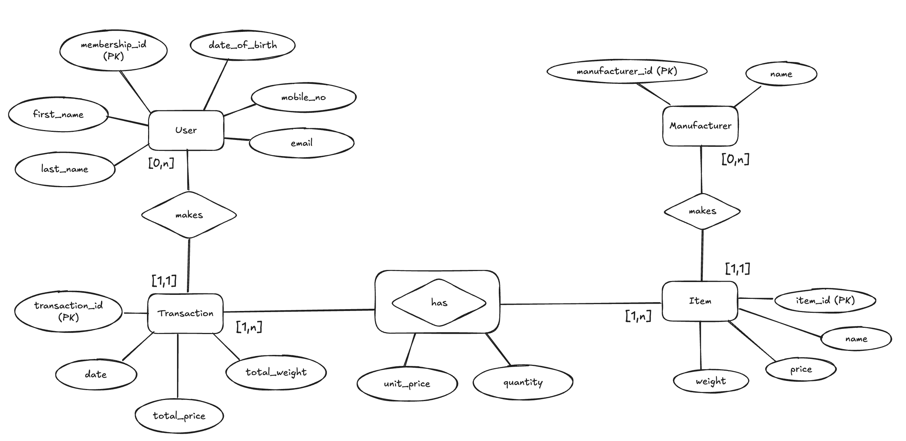

# Section 2: Databases

## Problem Statement

The objective of this section is to design and implement the transactional database for an e-commerce platform. The database must support members purchasing items, maintain the relationships between members, transactions, products and manufacturers, and enable downstream analysts to query business metrics efficiently.

## Summary

This solution delivers the following components:

- Designed a normalized PostgreSQL OLTP schema in Third Normal Form (3NF) to support transactional workloads.
- Produced an Entity Relationship Diagram (ERD) describing the entities, attributes and relationships within the database.
- Implemented all DDL statements required to create tables, primary keys, foreign keys and indexes.
- Populated the database with sample data to demonstrate the schema and support analytical queries.
- Created reusable SQL views that answer the required business questions:
  - Top 10 members by total spending.
  - Top 3 most frequently purchased items.
  - (Additional query) Which manufacturers generate the most revenue?
- Containerized the database using Docker Compose so that the entire environment can be recreated with a single command.
- Configured automatic database initialization, allowing schemas, sample data and analytical views to be created on first startup without manual intervention.

## Considerations for OLAP or OLTP

The database is designed as an OLTP schema using third normal form (3NF). Though the statement states to account for business queries, which might include aggregate reporting, the requested analytical queries can be efficiently executed using SQL aggregation and indexes. For larger analytical workloads, the transactional database could later feed an OLAP data warehouse through an ETL pipeline without requiring changes to the operational schema.

## Database design (OLTP)



### Considerations made during the design process

We can read the ERD from left to right, top to bottom.

The `User` entity stores information about registered members, including membership_id, first_name, last_name, email, phone_number. membership_id uniquely identifies each member and serves as the primary key. We note that the email field is unique for each user but cannot be shown in the diagram. The membership_id is the primary key for the user entity. The makes relationship between user and transaction is seen above.

The relationship between `User` and `Transaction` is a one-to-many relationship. A user may have zero or many (0,n) transactions over their lifetime, while each transaction belongs to exactly one user (1,1). The membership_id appears as a foreign key in the Transaction table. The `Transaction` entity contains the attributes from section 2, which include transaction_id, membership_id, date, total_items_price, and total_items_weight. The transaction_id is the primary key for the `Transaction` entity.

`Transactions` and `Items` have a many-to-many relationship, since a transaction may contain multiple items and each item may appear in many different transactions. To implement this relationship in a relational database, an associative entity/aggregate entity named `Transaction_Item` is introduced. Both the transaction and item entities have a cardinality of 1,n, which means that a transaction can contain 1 or more items and an item can be contained in 1 or more transactions. This confirms that it is a many-to-many relationship, . The `has`/`Transaction_Item` aggregate has attributes unit_price and quantity to support future business queries.

Note that we set a unit_price attribute in the `Transaction_Item` entity to support future business queries. This is because the price of an item may change over time, and we want to ensure that the price of an item at the time of purchase is recorded in the transaction. The quantity attribute is also included to support future business queries, as a member may purchase multiple quantities of an item in a single transaction.

The `Item` entity contains the attributes item_id, name, manufacturer_id, cost, and weight. The item_id is the primary key for the `Item` entity.

The `Manufacturer` entity includes manufacturer_id and name. The manufacturer_id is the primary key for the `Manufacturer` entity. The `Makes` relationship between manufacturer and item is a one-to-many relationship, as a manufacturer can produce 0 or many items, but an item can only be produced by one manufacturer.

## Setting up the PostgreSQL database using Docker

The PostgreSQL database is containerized using Docker Compose. The repository contains a compose.yaml file that starts both:

- a PostgreSQL database
- an Adminer instance for inspecting the database through a web browser

Start the services with:

```bash
docker compose up -d
```

Once the containers have started:

PostgreSQL is available on localhost:5432
Adminer is available on http://localhost:8080

Use the following credentials to log into Adminer:

| Field    | Value      |
| -------- | ---------- |
| System   | PostgreSQL |
| Server   | db         |
| Username | admin      |
| Password | password   |
| Database | ecommerce  |

### Automatic database initialization

The PostgreSQL container mounts the `database/init` directory into PostgreSQL's special initialization directory: `/docker-entrypoint-initdb.d`

During the first startup of a new database volume, PostgreSQL automatically executes every SQL script in this directory in lexicographical order.

The initialization scripts are organised as follows:

```
database/
└── init/
├── 001_create_tables.sql
├── 002_constraints_and_indexes.sql
├── 003_optional_roles_grants.sql
├── 004_insert_members.sql
├── 005_insert_manufacturers.sql
├── 006_insert_items.sql
├── 007_insert_transactions.sql
├── 008_insert_transaction_items.sql
└── 009_create_views.sql
```

These scripts perform the following tasks:

- create all database tables
- create primary keys and foreign keys
- create indexes
- create database roles and permissions
- insert sample data based on the successful membership creation from section 1 and dummy values for the other tables
- create analytical SQL views

No manual SQL execution is required.

### Rebuilding the database

PostgreSQL only executes the initialization scripts when the database volume is created for the first time.

If any schema or initialization scripts are modified, the existing database volume must be removed before recreating the container:

```
docker compose down -v
docker compose up -d
```

This recreates the database from scratch and reruns every SQL script in database/init.

### Verifying the installation

After the containers have started successfully, the following should be visible in Adminer:

Tables

- members
- manufacturers
- items
- transactions
- transaction_items

Views

- top_members_by_spending
- top_items_by_purchase_frequency
- top_manufacturers_by_revenue (Additional query)

The tables will already contain sample data inserted by the initialization scripts.

### Analytical queries

Although the assessment only requires SQL statements for two analytical questions, I chose to expose them as database views so that analysts can query them directly without repeatedly executing aggregation logic.

The views answer the following business questions:

Top 10 members ranked by total spending.
Top 3 most frequently purchased items.
Top manufacturers by revenue.

These views are created automatically during database initialization and are immediately available from Adminer.
