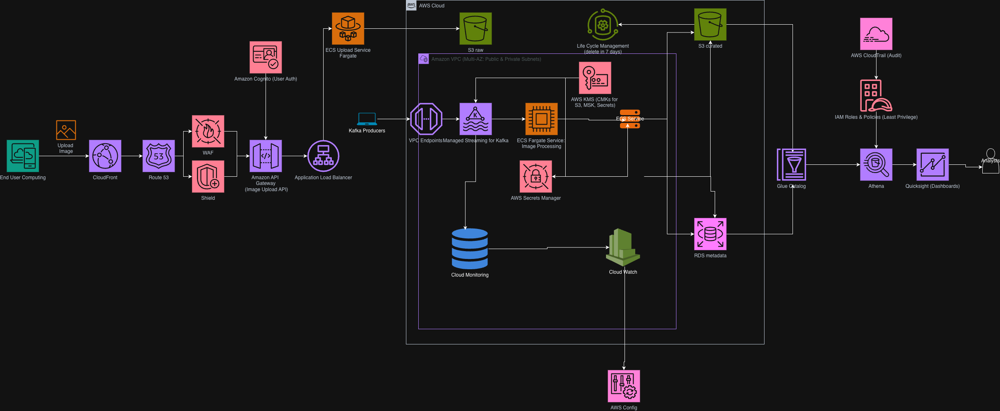

# Section 3: System Design

## Problem statement: Design 1

The operational PostgreSQL database designed in Section 2 is now shared across multiple internal teams. Although every team accesses the same underlying data, they have different responsibilities and therefore require different levels of access.

The objective is to design a secure access strategy that:

- allows each team to perform its required business functions,
- prevents unauthorized modifications,
- follows the principle of least privilege,
- remains easy to administer as the company grows.

The three business teams have the following requirements:

| Team      | Responsibilities                                                                          |
| --------- | ----------------------------------------------------------------------------------------- |
| Logistics | View sales details (particularly total shipment weight) and update completed transactions |
| Analytics | Perform reporting on sales and membership data. Must not be able to modify data           |
| Sales     | Maintain the product catalogue by adding new items and removing obsolete items            |

## Design

Since every department accesses the same operational PostgreSQL database, the most appropriate solution is Role-Based Access Control (RBAC).

Rather than granting permissions directly to individual employees, permissions are assigned to database roles that correspond to business functions. Users authenticate through the company's identity provider (for example Active Directory, Okta or cloud IAM) and are mapped onto the appropriate PostgreSQL role.

This provides:

- Principle of least privilege
- Centralized permission management
- Easier onboarding/offboarding
- Reduced risk of accidental data modification
- Better auditing and accountability
- Permission Model

The permissions are derived directly from the database schema created in Section 2.

| Table             | Logistics      | Analytics | Sales                          |
| ----------------- | -------------- | --------- | ------------------------------ |
| members           | SELECT         | SELECT    | —                              |
| transactions      | SELECT, UPDATE | SELECT    | —                              |
| transaction_items | SELECT         | SELECT    | —                              |
| items             | SELECT         | SELECT    | SELECT, INSERT, UPDATE, DELETE |
| manufacturers     | SELECT         | SELECT    | SELECT, INSERT, UPDATE         |

### Logistics

The logistics department is responsible for fulfilling orders.

They need to:

- determine shipment weights,
- retrieve purchased items,
- mark transactions as completed.

They therefore require read access to:

- `transactions`
- `transaction_items`
- `items`

We want to add a new field to the `transactions` table to indicate whether a transaction has been completed. Logistics would then have read access to all tables

```sql
ALTER TABLE transactions
ADD COLUMN status VARCHAR(20) NOT NULL DEFAULT 'PENDING';
```

and update access only on the transaction status (or completion flag in a production schema).

They do not require permissions to:

- modify members,
- modify products,
- modify manufacturers.

### Analytics

The analytics team performs reporting across:

- member behaviour,
- sales,
- purchasing trends.

Since they never perform operational updates, they should have read-only access to every table.

In production, analysts would ideally query reporting views rather than base tables.

### Sales

The sales department manages the product catalogue.

They therefore require write access to:

- `items`
- `manufacturers`

Example RBAC Implementation

```sql
CREATE ROLE logistics;
CREATE ROLE analytics;
CREATE ROLE sales;

-- Logistics
GRANT SELECT ON members TO logistics;
GRANT SELECT, UPDATE ON transactions TO logistics;
GRANT SELECT ON transaction_items TO logistics;
GRANT SELECT ON items TO logistics;

-- Analytics
GRANT SELECT ON ALL TABLES IN SCHEMA public TO analytics;

-- Sales
GRANT SELECT, INSERT, UPDATE, DELETE ON items TO sales;
GRANT SELECT, INSERT, UPDATE ON manufacturers TO sales;
```

In a production deployment, database roles would typically be assigned automatically through an enterprise identity provider rather than using local PostgreSQL passwords.

## Auditing

Since multiple departments modify production data, auditing should be enabled for all write operations.

An audit log should record:

- database user,
- timestamp,
- operation (INSERT/UPDATE/DELETE),
- affected table,
- affected row.

This provides:

traceability,
operational debugging,
compliance,
accountability for production changes.

## Future Improvements

If the company grows, the architecture can evolve further without changing the application layer.

Possible improvements include:

- introducing row-level security (RLS) if departments should only view subsets of data (for example regional logistics teams);
- replicating the OLTP database to a read replica dedicated to Analytics to isolate reporting workloads from transactional traffic;
- feeding an OLAP warehouse (such as Snowflake, BigQuery, or Redshift) for large-scale analytical reporting;
- integrating PostgreSQL authentication with enterprise IAM (LDAP, Active Directory, Okta, or cloud IAM) to centralize user management.

This design keeps the operational database secure while remaining simple, scalable, and aligned with the access requirements specified in the problem statement.

## Problem statement: Design 2

## Design



High availability is managed by using multiple availability zones (AZs) within a region. Each AZ is isolated from failures in other AZs, and provides inexpensive, low-latency network connectivity to other AZs in the same region. The architecture is designed to be fault-tolerant and highly available by deploying resources across multiple AZs.

Security is managed by using a combination of IAM roles, security groups, and VPCs to control access to resources.

Low Latency is achieved by using edge locations and content delivery networks (CDNs) to cache frequently accessed data closer to users like CloudFront.

Elasticity is achieved by using auto-scaling groups and serverless services like AWS Lambda to automatically adjust resources based on demand.

Efficiency is achieved by using serverless services like AWS Lambda and managed services like Amazon S3 and Amazon RDS to reduce operational overhead and costs.

Least Privilege is achieved by using IAM roles and policies to grant only the necessary permissions to users and services.

Fault Tolerance and Disaster Recovery is achieved by using multi-AZ deployments, automated backups, and cross-region replication for critical data. We also can rely on multi-AZ RDS, S3 versioning (optional), automated RDS snapshots and cross-region backups (optional).

Manageability is achieved by using managed services like Amazon RDS and Amazon S3, which handle maintenance tasks like patching and backups.

## Assumptions

- Images are uploaded through either a REST API or a Kafka producer.
- The image processing code already exists and only needs to be deployed.
- Images are treated as unstructured objects and stored in Amazon S3.
- The processing code can run in containers, so ECS Fargate is the best fit.
- Analysts query data in S3 using Athena rather than requiring a heavier warehouse.
- Kafka is managed by Amazon MSK and accessed privately from the company’s streaming app.
- Images are the primary payload; metadata is stored separately for querying and retention control.
- Metadata is stored separately in PostgreSQL to support relational queries.
- Business Intelligence workloads are read-only and query data through Athena and QuickSight rather than directly accessing the operational database.
- Images and associated metadata must be retained for 7 days, after which they are automatically deleted using S3 Lifecycle policies (and a corresponding metadata cleanup process, such as a scheduled Lambda or database job).
  The architecture targets high availability, least privilege, managed services, and serverless components where practical to reduce operational overhead and cost.
